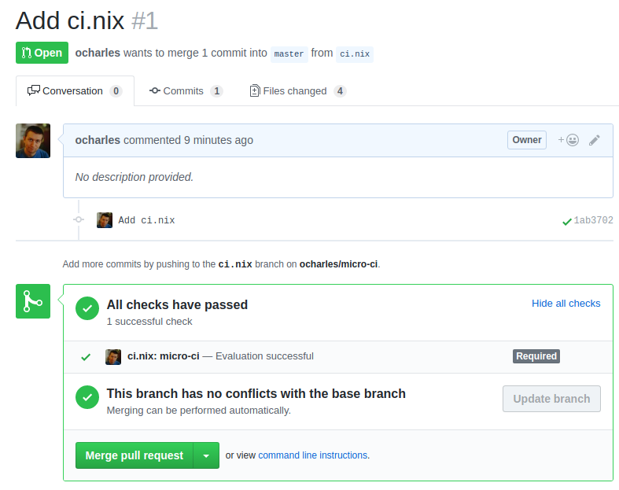

# micro-ci

Hello, thanks for checking out `micro-ci`.

`micro-ci` is a tiny continuous integration server, that tries to do
very little. By this, we mean off loading as much logic as possible to
other systems. In particular, this continuous integration server
*only* supports GitHub and Nix.

This project is in its infancy, but if you'd like to play along at
home, here's how.



## Getting Started

1. **Get an OAuth token.**

   Navigate to https://github.com/settings/tokens and generate a new
   OAuth token. It only needs the `repo:status` permission.

2. **Add the webhook.**

   Go to https://github.com/$YOUR_NAME/$YOUR_REPO/settings/hooks,
   changing `$YOUR_NAME` and `$YOUR_REPO` appropriately. Add a webhook
   with a URL of the format: `http://$PUBLIC_HOST:8080/github/web-hook`,
   where `$PUBLIC_HOST` is the publically accessible host of the
   server that will be running your builds.
   
   Set:
   
   * Content type: `application/json`
   * Secret: (anything you want)
   * Which events: at least "pull request", but you can also just use
     "everything".

4. **Configure the server**.

	In the directory you plan to run `micro-ci` from, you'll need a
    `config.dhall` file. A template is:
	
	```dhall
	{
      repoRoot = "repositories",
      secret = ...,
      oauth = ...
	}
	```
	
	Fill in `oauth` and `secret` according to values previously retrieved/entered.
	 
4. **Run the server**.

	On the machine that will run the builds, run
	
	```
	nix-shell --pure --run 'ghc --make Setup.hs && ./Setup configure && ./Setup build'
	./dist/build/micro-ci/micro-ci
	```

5. **Add a `ci.nix` file to your project**.

	Finally, write a `ci.nix` file in your project. This Nix
    expression should evaluate to an attribute-set of derivations.
	
	For example, a Haskell project could use:
	
	```nix
	with (import <nixpkgs> {});
	{
	  cabal-build = haskellPackages.callPackage ./default.nix {};
	}
	```
	
	But you can be as clever as you want. All that `micro-ci` cares
    about is if the derivation can be evaluated.

6. *Optional*: **Add status checks**

	Open a pull request to check that everything works. If it looks
    good, you can enforce `micro-ci` to pass all jobs. Head to
    https://github.com/$YOUR_NAME/$YOUR_REPO/settings/branches and set
    up a protected branch and add the `ci.nix` statuses.
